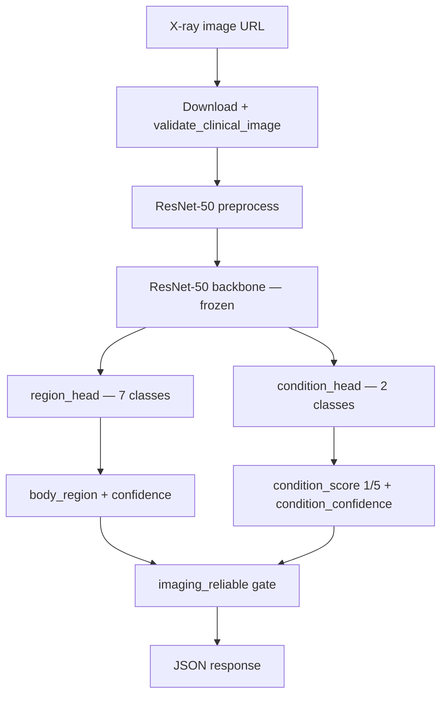
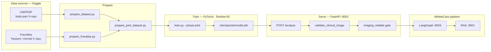

# AthleteCare Image Analyser (Service 2)

## Overview

Service 2 is a clinical **X-ray triage API** for AthleteCare. Given a public image URL, it downloads the image, validates that it looks like a radiograph, runs a dual-head ResNet-50 model, and returns structured triage fields for downstream services (LangGraph → RAG → Guardrails).

| | |
|--|--|
| Port | **8002** |
| Endpoint | `POST /analyse` |
| Input | `{ "image_url": "<url>" }` |
| Output | `{ "body_region", "condition_score", "confidence", "condition_confidence", "imaging_reliable" }` |

### Response fields

| Field | Type | Meaning |
|-------|------|---------|
| `body_region` | string | Predicted anatomical region: `ankle`, `knee`, `foot`, `lower_leg`, `thigh`, `hip`, or `other` |
| `condition_score` | `1` \| `5` \| `null` | Imaging abnormality **proxy**: **1** = normal, **5** = fracture-like. `null` when inconclusive |
| `confidence` | float (0–1) | Softmax confidence for the **region** head |
| `condition_confidence` | float \| `null` | Softmax confidence for the **binary condition** head; `null` when suppressed |
| `imaging_reliable` | bool | `true` only when region is localized, both thresholds pass, and `condition_score` is present |

**Important:** `condition_score` is **not** clinical return-to-play severity, hamstring grade, or a confirmed diagnosis. It is a coarse normal-vs-fracture-like signal on X-ray. LangGraph and Guardrails treat it as a **proxy** only.

---

## Recent improvements (Phases 0 → A → B)

The service went through four improvement rounds. Together they fix invalid scores, add safety gates, improve rare-region accuracy, and align with the rest of the AthleteCare pipeline.

### Phase 0 — Binary condition head

**Problem:** The original model used a 5-class condition head (`NUM_CONDITION_SCORES = 5`), but FracAtlas training labels are **binary** only: normal (`1`) and fracture (`5`). Scores **2, 3, 4** were never trained but could appear at inference — misleading downstream RAG/LLM enrichment.

**Solution:**

- Condition head reduced to **2 outputs** (`NUM_CONDITION_CLASSES = 2`).
- API still returns familiar scores **1** and **5** via `CONDITION_CLASS_TO_SCORE`.
- New fields: `condition_confidence`, `imaging_reliable`.

| Before | After |
|--------|-------|
| 5-class head; scores 1–5 possible | Binary head; only **1**, **5**, or `null` |
| Single `confidence` (region only) | Separate region + condition confidence |
| No reliability flag | `imaging_reliable` gates downstream use |

**Files:** `app/config.py`, `app/model.py`, `app/main.py`, `scripts/train.py`

---

### Phase A — Safety gates & radiograph validation (no retrain)

**Problem:** Low-confidence or unlocalized predictions were still sent as hard facts. Colour photos could be scored like X-rays. LangGraph always enriched RAG queries with `condition_score`, even when region was `other`.

**Solution:**

| Change | Detail |
|--------|--------|
| **Higher condition threshold** | `CONDITION_CONFIDENCE_THRESHOLD` default **0.65** (was 0.55). Prefer `null` over a wrong confident score |
| **`other` suppresses condition** | If `body_region == "other"` (low region confidence or unlocalized), `condition_score` and `condition_confidence` are forced to `null`, `imaging_reliable = false` |
| **Radiograph validation** | New `app/image_validation.py` — minimum size + grayscale heuristic. Colour photos → **HTTP 422** |
| **Downstream alignment** | LangGraph enriches RAG with condition only when `imaging_reliable=true` and region ≠ `other` (see LangGraph-Service) |

**Inference gate logic** (`app/main.py`):

```
region uncertain (confidence < 0.45)  →  body_region = "other"
region_ok   = region localized AND not uncertain
condition_ok = condition_confidence >= 0.65
imaging_reliable = region_ok AND condition_ok

if NOT imaging_reliable:
    condition_score = null
    condition_confidence = null
```

**Image validation** (`app/image_validation.py`):

- Rejects images smaller than 64×64 (configurable).
- Rejects colour photographs: mean channel difference above `MAX_CHANNEL_DIFF` (default 28.0).
- X-rays are nearly grayscale and pass; selfies / clinical photos fail early.

**Observed effect (test set, API logic applied):**

| Metric | Before Phase A | After Phase A |
|--------|----------------|---------------|
| `other` + non-null `condition_score` | 83 | **0** |
| Reliable but wrong condition | ~21% | **~12.5%** |
| `imaging_reliable` rate | ~92% | **~44%** (more conservative — intentional) |

---

### Phase B — Class weights + retrain

**Problem:** Region classes are heavily imbalanced (`other` / `lower_leg` dominate; `thigh` has very few samples). The model learned to guess common classes; **hip** accuracy was ~33%. Condition loss was under-weighted vs region loss in joint training.

**Solution:**

| Change | Detail |
|--------|--------|
| **Region class weights** | Inverse-frequency weights in `CrossEntropyLoss` (e.g. rare `thigh` ≈ 27.5, frequent `other` ≈ 0.33). On by default; disable with `--no-region-class-weights` |
| **Condition class weights** | Same strategy for the binary head. Disable with `--no-condition-class-weights` |
| **`condition_loss_weight`** | Default **1.5** (was 1.0): `loss = loss_region + 1.5 × loss_condition` |
| **Retrain** | New `checkpoints/model.pth` with metadata (weights, test metrics) |

**Recommended train command:**

```powershell
python scripts/train.py --phase joint --epochs-joint 15 --condition-loss-weight 1.5
```

**Observed effect (test set, raw ML + API gates):**

| Metric | After Phase 0 | After Phase B |
|--------|---------------|---------------|
| Region accuracy | ~93.1% | **~91.9%** (slight tradeoff) |
| Condition accuracy | ~75.3% | **~74.7%** |
| Both correct (known labels) | ~72.2% | **~73.2%** |
| Hip region accuracy | ~33% | **~67%** |
| Ankle region accuracy | ~83% | **~100%** |
| Reliable but wrong | ~12.5% | **~11.8%** |

---

### Phase C — Downstream integration (Image Analyser scope)

Most Phase C work lives in **RAG-Service** and **LangGraph-Service**. Image Analyser contributes:

| Item | Status |
|------|--------|
| Stable `body_region` labels for mapping | ✅ `ankle`, `knee`, `foot`, `lower_leg`, `thigh`, `hip`, `other` |
| `imaging_reliable` for conditional enrichment | ✅ consumed by LangGraph `agent.py` |
| **`--pretrain-region` CLI** | ✅ optional: train region head on UNIFESP first, then joint from `model.region.pth` |

**Optional pretrain (not run by default):**

```powershell
python scripts/train.py --phase joint --pretrain-region --epochs-joint 15
```

LangGraph maps imaging regions to RAG metadata (e.g. `lower_leg` → `["calf", "hamstring"]`) via `LangGraph-Service/app/region_map.py`.

---

## Tech stack

| Layer | Tools | Role |
|-------|--------|------|
| API | **FastAPI**, **Uvicorn**, **Pydantic** | HTTP service, request/response validation |
| Inference I/O | **httpx**, **Pillow**, **numpy** | Download image, decode pixels, radiograph heuristics |
| Model | **PyTorch**, **torchvision**, **ResNet-50** | Frozen ImageNet backbone + dual classification heads |
| Dataset prep | **pydicom**, **Pillow**, **numpy** | DICOM→PNG (UNIFESP), CSV labels, joint table |
| Training | **PyTorch**, **scikit-learn**, **tqdm** | Train/val/test split, weighted loss, metrics, checkpoint |

---

## Model architecture



| Component | Output |
|-----------|--------|
| `region_head` | 7 AthleteCare body regions |
| `condition_head` | 2 classes → mapped to scores **1** (normal) or **5** (fracture-like) |
| Backbone | Frozen ImageNet ResNet-50; only heads are trained |

Class index order for regions is defined in `app/config.py` → `BODY_REGION_CLASSES`.

---

## Data sources

Zips are **not** committed; prepare scripts unpack them into `data/` (gitignored).

| Dataset | Where we got it | Kind of data | Used for |
|---------|-----------------|--------------|----------|
| **UNIFESP** X-ray body-part classification | [Kaggle — UNIFESP X-Ray Body Part Classification](https://www.kaggle.com/datasets/felipekitamura/unifesp-xray-bodypart-classification) (local zip: `archive.zip`) | Clinical **X-rays labelled by body part** (codes → ankle, knee, foot, hip, …) | Head #1 **region** (~331 images after prep) |
| **FracAtlas** (via multi-task skeletal set) | [Kaggle — Multi-Task Skeletal Radiograph Dataset](https://www.kaggle.com/datasets/kaziaishikuzzaman/multi-task-skeletal-radiograph-dataset) (local zip: `fracatlas.zip`) | Skeletal **X-rays with fracture / normal labels**, plus coarse region (hip, leg, hand, shoulder) | Head #2 **condition** (1 vs 5) + remapped region (~1322 images) |

**Joint table:** `data/joint/labels.csv` — **1653** rows (331 UNIFESP + 1322 FracAtlas).

### Dual heads (joint training)

Both heads train together on the combined table so they share one image distribution:

| Head | Field | Labels come from |
|------|--------|------------------|
| #1 Region | `body_region` | UNIFESP + FracAtlas regions remapped into AthleteCare classes |
| #2 Condition | binary class → **1** or **5** | FracAtlas only (`condition_known=1`); UNIFESP rows ignored in condition loss |

Training uses `condition_class_from_row()` in `app/config.py` to map FracAtlas `fractured` / legacy scores to class 0 (normal) or 1 (fracture-like).

### UNIFESP region map

| Class | UNIFESP code |
|-------|----------------|
| ankle | 1 |
| knee | 11 |
| foot | 6 |
| lower_leg | 12 |
| thigh | 19 |
| hip | 10 |
| other | remaining codes (sampled) |

### FracAtlas maps

| FracAtlas `fractured` | API `condition_score` |
|-----------------------|----------------------|
| 0 | 1 |
| 1 | 5 |

| FracAtlas `body_region` | AthleteCare class |
|-------------------------|-------------------|
| hip | hip |
| leg | lower_leg |
| hand | other |
| shoulder | other |

---

## End-to-end pipeline



| Step | What happens | Tech used |
|------|----------------|-----------|
| **1. Acquire data** | Download UNIFESP + FracAtlas from Kaggle; keep local zips | Browser / Kaggle |
| **2. Prepare UNIFESP** | Map body-part codes → AthleteCare classes; DICOM→PNG; `data/labels.csv` | **pydicom**, **Pillow** |
| **3. Prepare FracAtlas** | Map `fractured`→1/5; copy images; `data/fracatlas/labels.csv` | **Pillow** |
| **4. Join labels** | Build `data/joint/labels.csv` | `prepare_joint_dataset.py` |
| **5. Train** | Weighted joint loss; optional `--pretrain-region`; save checkpoint | **PyTorch**, **scikit-learn** |
| **6. Run API** | Load checkpoint; serve on port 8002 | **FastAPI**, **Uvicorn** |
| **7. Inference** | Download → validate → preprocess → dual-head forward → gate → JSON | **httpx**, **Pillow**, **numpy**, **PyTorch** |
| **8. Downstream** | LangGraph calls `/analyse`; passes `body_regions` to RAG when region is localized | HTTP to LangGraph / RAG |

---

## Configuration (environment variables)

| Variable | Default | Purpose |
|----------|---------|---------|
| `CONFIDENCE_THRESHOLD` | `0.45` | Below this region softmax → force `body_region="other"` |
| `CONDITION_CONFIDENCE_THRESHOLD` | `0.65` | Below this → suppress `condition_score` (`null`) |
| `MODEL_CHECKPOINT` | `checkpoints/model.pth` | Path to trained weights |
| `REQUEST_TIMEOUT_SEC` | `30` | Image download timeout |
| `MIN_IMAGE_WIDTH` | `64` | Radiograph validation minimum width |
| `MIN_IMAGE_HEIGHT` | `64` | Radiograph validation minimum height |
| `MAX_CHANNEL_DIFF` | `28.0` | Max RGB channel diff before rejecting as colour photo |

---

## Setup

```powershell
cd Image-Analyser-Service
py -3.11 -m venv .venv
.\.venv\Scripts\Activate.ps1
pip install --upgrade pip
pip install torch torchvision --index-url https://download.pytorch.org/whl/cpu
pip install -r requirements.txt
```

> Python 3.11 is documented for the assignment; 3.13 has been used successfully in local development.

---

## Prepare datasets (zips not committed)

```powershell
python scripts/prepare_dataset.py --zip "path\to\archive.zip"
python scripts/prepare_fracatlas.py --zip "path\to\fracatlas.zip"
python scripts/prepare_joint_dataset.py
```

---

## Train

### Recommended — joint (default)

```powershell
python scripts/train.py --phase joint --epochs-joint 15 --condition-loss-weight 1.5
```

**Defaults and behaviour:**

- **Inverse-frequency class weights** for region and condition heads (disable: `--no-region-class-weights`, `--no-condition-class-weights`)
- **`--condition-loss-weight 1.5`** — condition head weighted higher in joint loss
- Frozen backbone; train `region_head` + `condition_head` together
- Region loss on all rows; condition loss only when `condition_known=1`
- Augmentation: horizontal flip, ±10° rotation, ColorJitter
- Stratified 70/15/15 train/val/test split by `body_region`
- Early stopping on validation region accuracy (patience 5)
- Saves `checkpoints/model.pth` with test metrics in checkpoint metadata

### Optional — region pretrain before joint

Useful when region head needs stronger UNIFESP initialization before joint fine-tuning:

```powershell
python scripts/train.py --phase joint --pretrain-region --epochs-region 15 --epochs-joint 15
```

Writes intermediate checkpoint to `checkpoints/model.region.pth`, then runs joint training from that state.

### Legacy phases

Still available for experimentation:

```powershell
python scripts/train.py --phase region      # UNIFESP region only
python scripts/train.py --phase condition   # FracAtlas condition only
python scripts/train.py --phase both        # sequential region → condition
```

---

## Run API (port 8002)

```powershell
uvicorn app.main:app --host 0.0.0.0 --port 8002
```

Or from repo root:

```powershell
.\scripts\start-image-analyser.ps1
```

### Health check

```powershell
curl.exe http://127.0.0.1:8002/health
```

Example response:

```json
{
  "status": "ok",
  "device": "cpu",
  "confidence_threshold": 0.45,
  "condition_confidence_threshold": 0.65,
  "body_region_classes": ["ankle", "knee", "foot", "lower_leg", "thigh", "hip", "other"],
  "condition_head": "binary",
  "condition_scores": [1, 5],
  "checkpoint_loaded": true,
  "checkpoint_path": "...\\checkpoints\\model.pth"
}
```

### Analyse example

```powershell
curl.exe -X POST http://127.0.0.1:8002/analyse ^
  -H "Content-Type: application/json" ^
  -d "{\"image_url\":\"https://upload.wikimedia.org/wikipedia/commons/.../X-ray_example.jpg\"}"
```

**Example — reliable prediction:**

```json
{
  "body_region": "hip",
  "condition_score": 5,
  "confidence": 0.9124,
  "condition_confidence": 0.7831,
  "imaging_reliable": true
}
```

**Example — inconclusive condition (conservative gate):**

```json
{
  "body_region": "lower_leg",
  "condition_score": null,
  "confidence": 0.8812,
  "condition_confidence": null,
  "imaging_reliable": false
}
```

**Example — validation rejection (HTTP 422):**

```json
{
  "detail": "Image appears to be a colour photograph, not a clinical X-ray radiograph."
}
```

---

## HTTP status codes

| Code | When |
|------|------|
| **200** | Successful analysis |
| **400** | Failed to download URL or invalid image bytes |
| **422** | Image failed radiograph validation (colour photo, too small) |
| **503** | Model still loading |

---

## Project layout

```
Image-Analyser-Service/
├── app/
│   ├── config.py              # Classes, thresholds, checkpoint path
│   ├── image_validation.py    # Radiograph heuristics (Phase A)
│   ├── main.py                # FastAPI + inference gates
│   └── model.py               # ResNet-50 dual-head (binary condition)
├── scripts/
│   ├── prepare_dataset.py     # UNIFESP
│   ├── prepare_fracatlas.py   # FracAtlas
│   ├── prepare_joint_dataset.py
│   └── train.py               # --phase joint (default), class weights, --pretrain-region
├── data/                      # gitignored
│   └── joint/labels.csv
├── checkpoints/               # gitignored — model.pth after train.py
└── requirements.txt
```

---

## Integration with AthleteCare services

| Consumer | How imaging output is used |
|----------|----------------------------|
| **LangGraph (:8003)** | Calls `POST /analyse` when planner selects `image_analyser`. Enriches RAG query with region ± condition only when `imaging_reliable=true` and region ≠ `other` |
| **RAG (:8001)** | Receives optional `body_regions` filter from LangGraph (mapped from imaging `body_region`) |
| **Guardrails (:8000)** | Blocks definitive fracture/RTP claims based solely on imaging proxy |
| **WebUI (:8004)** | Disclaimer: URLs must be X-rays; score is proxy not diagnosis |

Imaging alone never drives return-to-play timelines — those come from retrieved club protocols and cases.

---

## Known limitations

| Limitation | Notes |
|------------|-------|
| Condition accuracy ~72–75% | Binary head + gates reduce harm but do not reach ~90% ML accuracy |
| Rare regions (`thigh`) | Very few training samples; class weights help but data remains sparse |
| Frozen backbone | Backbone not fine-tuned; `--pretrain-region` available but optional |
| Grayscale heuristic | May reject tinted X-rays or accept some grayscale non-radiographs |
| Scores 2–3–4 | **Never emitted** after Phase 0; legacy 5-class checkpoints are incompatible |

---

## Assignment notes

- Transfer learning: freeze ResNet-50 backbone, train dual heads
- ≥200 labelled images (1653 joint)
- Documented augmentation + test metrics from `train.py`
- Binary condition head aligns labels with FracAtlas (normal vs fracture)
- Safety gates + radiograph validation for production-style triage behaviour
- Docker / EC2 not required for this local step
