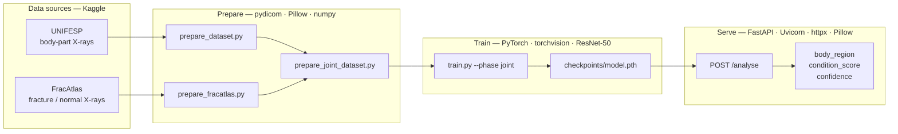

# AthleteCare Image Analyser (Service 2)

## Overview

Service 2 is a clinical **X-ray triage API** for AthleteCare. Given an image URL, it returns:

1. **`body_region`** — soccer-relevant part (`ankle`, `knee`, `foot`, `lower_leg`, `thigh`, `hip`, or `other`)
2. **`condition_score`** — abnormality proxy on a 1–5 scale (trained as normal→**1**, fracture→**5**)
3. **`confidence`** — model confidence for the region prediction

It uses a **frozen ResNet-50 backbone** with two trained heads (region + condition), exposed as a FastAPI service on port **8002**.

| | |
|--|--|
| Endpoint | `POST /analyse` |
| Input | `{ "image_url": "<url>" }` |
| Output | `{ "body_region", "condition_score", "confidence" }` |

`condition_score` is a **proxy** (normal vs fracture), not clinical return-to-play severity. Mid-scores 2–4 are not trained. If region confidence &lt; `CONFIDENCE_THRESHOLD` (default `0.45`), `body_region` is forced to `"other"`.

---

## Tech stack

| Layer | Tools | Role |
|-------|--------|------|
| API | **FastAPI**, **Uvicorn**, **Pydantic** | HTTP service, request/response validation |
| Inference I/O | **httpx**, **Pillow** | Download image from URL, open/decode pixels |
| Model | **PyTorch**, **torchvision**, **ResNet-50** | Frozen ImageNet backbone + dual classification heads |
| Dataset prep | **pydicom**, **Pillow**, **numpy** | DICOM→PNG (UNIFESP), CSV labels, joint table |
| Training | **PyTorch**, **scikit-learn**, **tqdm** | Train/val/test split, loss loop, metrics, checkpoint |

---

## Data sources

Zips are **not** committed; prepare scripts unpack them into `data/` (gitignored).

| Dataset | Where we got it | Kind of data | Used for |
|---------|-----------------|--------------|----------|
| **UNIFESP** X-ray body-part classification | [Kaggle — UNIFESP X-Ray Body Part Classification](https://www.kaggle.com/datasets/felipekitamura/unifesp-xray-bodypart-classification) (local zip: `archive.zip`) | Clinical **X-rays labelled by body part** (codes → ankle, knee, foot, hip, …) | Head #1 **region** (~331 images after prep) |
| **FracAtlas** (via multi-task skeletal set) | [Kaggle — Multi-Task Skeletal Radiograph Dataset](https://www.kaggle.com/datasets/kaziaishikuzzaman/multi-task-skeletal-radiograph-dataset) (local zip: `fracatlas.zip`) | Skeletal **X-rays with fracture / normal labels**, plus coarse region (hip, leg, hand, shoulder) | Head #2 **condition** (1 vs 5) + remapped region (~1322 images) |

**Joint table:** `data/joint/labels.csv` — **1653** rows (331 UNIFESP + 1322 FracAtlas).

### Dual heads (joint training)

Both heads train together on the combined table so they share one image distribution:

| Head | Field | Labels come from |
|------|--------|------------------|
| #1 Region | `body_region` | UNIFESP + FracAtlas regions remapped into AthleteCare classes |
| #2 Condition | `condition_score` (1–5) | FracAtlas only (normal→**1**, fracture→**5**); UNIFESP condition ignored in loss |

### UNIFESP region map

| Class | UNIFESP code |
|-------|----------------|
| ankle | 1 |
| knee | 11 |
| foot | 6 |
| lower_leg | 12 |
| thigh | 19 |
| hip | 10 |
| other | remaining codes (sampled) |

### FracAtlas maps

| FracAtlas `fractured` | `condition_score` |
|-----------------------|-------------------|
| 0 | 1 |
| 1 | 5 |

| FracAtlas `body_region` | AthleteCare class |
|-------------------------|-------------------|
| hip | hip |
| leg | lower_leg |
| hand | other |
| shoulder | other |

---

## Dataflow diagram



---

## End-to-end flow (and which stack each step uses)

| Step | What happens | Tech used |
|------|----------------|-----------|
| **1. Acquire data** | Download UNIFESP + FracAtlas from Kaggle; keep local zips | Browser / Kaggle (offline zips) |
| **2. Prepare UNIFESP** | Map body-part codes → AthleteCare classes; DICOM→PNG; write `data/labels.csv` | **pydicom**, **Pillow**, Python CSV |
| **3. Prepare FracAtlas** | Map `fractured`→1/5; copy images; write `data/fracatlas/labels.csv` | **Pillow**, Python CSV |
| **4. Join labels** | Build `data/joint/labels.csv` (region always; condition only when known) | Python CSV (`prepare_joint_dataset.py`) |
| **5. Train** | Freeze ResNet-50; train dual heads with flip/rotate/ColorJitter; save checkpoint | **PyTorch**, **torchvision**, **scikit-learn**, **tqdm** |
| **6. Run API** | Load `model.pth`; expose `POST /analyse` on port 8002 | **FastAPI**, **Uvicorn**, **Pydantic** |
| **7. Inference request** | Client sends `image_url` → download → preprocess → dual-head forward → JSON | **httpx**, **Pillow**, **PyTorch** |

Reported (local CPU, joint, 1653 images):

- **Test region 93.5% · condition 78.8% · both-correct (known) 75.8%**

---

## Setup

```powershell
cd Image-Analyser-Service
py -3.11 -m venv .venv
.\.venv\Scripts\Activate.ps1
pip install --upgrade pip
pip install torch torchvision --index-url https://download.pytorch.org/whl/cpu
pip install -r requirements.txt
```

## Prepare datasets (zips not committed)

```powershell
python scripts/prepare_dataset.py --zip "path\to\archive.zip"
python scripts/prepare_fracatlas.py --zip "path\to\fracatlas.zip"
python scripts/prepare_joint_dataset.py
```

## Train (joint — recommended)

```powershell
python scripts/train.py --phase joint
```

- Freeze backbone; train `region_head` + `condition_head` together
- Region loss on all rows; condition loss only when FracAtlas label exists
- Augmentation: horizontal flip, ±10° rotation, ColorJitter
- Reports region / condition / **both-correct** accuracy on FracAtlas-labelled val/test rows
- Saves `checkpoints/model.pth`

Legacy separate phases still available: `--phase region|condition|both`.

## Run API (port 8002)

```powershell
uvicorn app.main:app --host 0.0.0.0 --port 8002
```

Or from repo root: `.\scripts\start-image-analyser.ps1`

```powershell
curl.exe http://127.0.0.1:8002/health
curl.exe -X POST http://127.0.0.1:8002/analyse -H "Content-Type: application/json" -d "{\"image_url\":\"https://...\"}"
```

## Layout

```
Image-Analyser-Service/
├── app/                        # FastAPI + model load/infer
├── scripts/
│   ├── prepare_dataset.py      # UNIFESP
│   ├── prepare_fracatlas.py    # FracAtlas
│   ├── prepare_joint_dataset.py
│   └── train.py                # --phase joint (default)
├── data/                       # gitignored
│   └── joint/labels.csv
├── checkpoints/                # gitignored
└── requirements.txt
```

## Assignment notes

- Transfer learning: freeze ResNet-50 backbone, train dual heads
- ≥200 labelled images (1653 joint)
- Documented augmentation + test metrics from `train.py`
- Docker / EC2 not required for this local step
