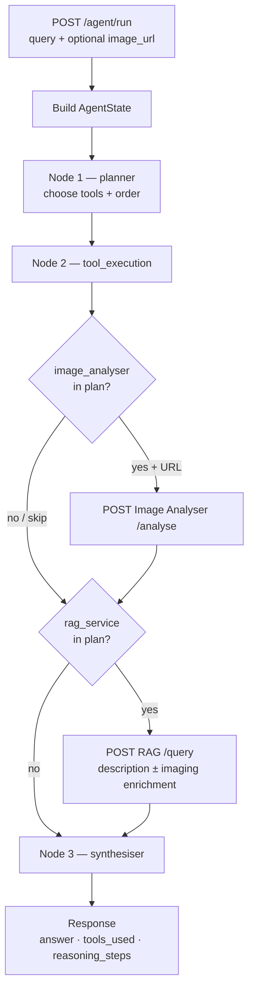

# AthleteCare LangGraph Agent (Service 4)

## Overview

Service 4 is a **stateful multi-step clinical agent** for AthleteCare. Given a complex question (and optionally an X-ray URL), it plans which tools to call, executes them over HTTP, and synthesises a grounded answer.

It does **not** replace the n8n AI Agent (Node 5). Per the course guideline, n8n keeps orchestration and may call **three** tools: RAG, Image Analyser, and **this** LangGraph service. Use LangGraph when the question needs a coordinated imaging + club-knowledge workflow in one call.

| | |
|--|--|
| Endpoint | `POST /agent/run` |
| Input | `{ "query": "<complex question>", "image_url": "<optional>" }` |
| Output | `{ "answer", "tools_used", "reasoning_steps" }` |
| Port | **8003** |
| Downstream tools | Image Analyser (`:8002`), RAG Service (`:8001`) |

**Typical workflow:** start RAG + Image Analyser → start this API → `POST /agent/run` with a multi-step clinical `query` (and `image_url` when imaging is involved).

---

## Tech Stack

| Layer | Technology | Role |
|-------|------------|------|
| API | FastAPI + Uvicorn + Pydantic | HTTP contract, request/response validation |
| Orchestration | LangGraph (`StateGraph`) | Linear agent graph: planner → tools → synthesiser |
| Planner / synthesis LLM | OpenAI Chat Completions (`openai`) | Tool selection JSON + final answer (when configured) |
| Fallback | Heuristic rules in `llm.py` | Offline / no-key demo path |
| Tool I/O | httpx | HTTP clients for RAG + Image Analyser |
| Config | python-dotenv | Load `.env` for URLs and LLM settings |

---

## Graph Nodes

The compiled graph is linear (assignment-appropriate “basic” agent):

```text
planner → tool_execution → synthesiser → END
```

### 1. `planner`

| | |
|--|--|
| **Job** | Decide which tools to run and in what order |
| **Reads** | `query`, optional `image_url`, tool descriptions from `prompts.py` |
| **Writes** | `plan`, `plan_rationale`, appends a planner line to `reasoning_steps` |
| **Logic** | OpenAI returns JSON `{"tools": [...], "rationale": "..."}` when `OPENAI_API_KEY` is set; otherwise a keyword heuristic. Prefer `image_analyser` before `rag_service` when both are needed. Drop `image_analyser` if no URL. |

Tool description text is versioned (`TOOL_DESCRIPTIONS_VERSION`) so prompt-engineering iterations can be logged for the assignment.

### 2. `tool_execution`

| | |
|--|--|
| **Job** | Invoke selected tools over HTTP in plan order |
| **Reads** | `plan`, `query`, `image_url` |
| **Writes** | `tool_results`, `tools_used`, appends per-tool lines to `reasoning_steps` |
| **Tools** | `image_analyser` → `POST {IMAGE_ANALYSER_URL}/analyse` · `rag_service` → `POST {RAG_SERVICE_URL}/query` |
| **Enrichment** | If imaging succeeds first, the RAG `description` is enriched with `body_region` + `condition_score` so retrieval is more targeted |

Failures are captured in `tool_results` / `reasoning_steps` (they do not crash the graph); the synthesiser reports them briefly.

### 3. `synthesiser`

| | |
|--|--|
| **Job** | Merge tool outputs into a concise clinical answer |
| **Reads** | `query`, `tools_used`, `tool_results`, `reasoning_steps` |
| **Writes** | `answer`, final synthesiser line in `reasoning_steps` |
| **Logic** | OpenAI synthesis with `SYNTHESISER_SYSTEM` when configured; otherwise a template that surfaces imaging fields + RAG insight / IDs |

---

## Project Structure

```
LangGraph-Service/
├── app/
│   ├── __init__.py        # Package marker for the LangGraph agent service
│   ├── main.py            # FastAPI app: /health, /, POST /agent/run
│   ├── agent.py           # LangGraph StateGraph, nodes, and run_agent()
│   ├── tools.py           # httpx clients for rag_service and image_analyser
│   ├── llm.py             # OpenAI planner/synthesiser + heuristic fallback
│   ├── prompts.py         # Tool descriptions + planner/synthesiser system prompts
│   └── config.py          # Env-driven URLs, timeouts, and LLM settings
├── requirements.txt       # Python dependencies
├── .env.example           # Template for local configuration (copy to .env)
└── README.md              # This documentation
```

Repo helper (outside this folder): `scripts/start-langgraph.ps1` — activates the service venv and starts Uvicorn on port 8003.

---

## Data Flow



### Steps (one request)

| Step | Where | What happens |
|------|--------|----------------|
| 1 | `main.py` | Validate `query` (and optional `image_url`); call `run_agent()` |
| 2 | `agent.py` | Initialise `AgentState` (empty plan, tools, answer) |
| 3 | **planner** | LLM or heuristic selects `image_analyser` / `rag_service` order |
| 4 | **tool_execution** | For each planned tool: HTTP call; record result + reasoning step |
| 4a | Image tool | `body_region`, `condition_score`, `confidence` → may enrich RAG text |
| 4b | RAG tool | `similar_listings` + `insight` from club cases/protocols |
| 5 | **synthesiser** | Produce final `answer` from tool outputs only (no invented IDs) |
| 6 | `main.py` | Return `{ answer, tools_used, reasoning_steps }` |

### Shared state (`AgentState`)

| Field | Meaning |
|-------|---------|
| `query` / `image_url` | Request inputs |
| `plan` / `plan_rationale` | Planner output |
| `tool_results` | Raw per-tool payloads (`ok` / `error`) |
| `tools_used` | Names actually invoked (assignment field) |
| `reasoning_steps` | Human-readable trace across nodes (assignment field) |
| `answer` | Final synthesis |

---

## API

| Method | Path | Description |
|--------|------|-------------|
| `GET` | `/` | Service identity + node/tool names |
| `GET` | `/health` | Readiness: LLM mode, downstream URLs, tool-description version |
| `POST` | `/agent/run` | Run the full graph |

Interactive docs: `http://127.0.0.1:8003/docs`

### Request

```json
{
  "query": "Given this hip X-ray and pain 9/10 after a tackle fall, what is the imaging triage and what do club hip cases/protocols say for urgent management and RTP?",
  "image_url": "http://127.0.0.1:8768/09_extreme_snapped_femur.png"
}
```

`image_url` is optional. Omit it for protocol/case-only questions; the planner will not call `image_analyser`.

### Response

```json
{
  "answer": "Imaging triage: body_region=hip, condition_score=5, ... Club knowledge: ...",
  "tools_used": ["image_analyser", "rag_service"],
  "reasoning_steps": [
    "Planner (v1): selected tools=['image_analyser', 'rag_service']. Rationale: ...",
    "Tool execution: image_analyser -> body_region=hip, condition_score=5, confidence=0.86",
    "Tool execution: rag_service -> 3 listing(s); ids=['CASE-...', 'PROT-...']",
    "Synthesiser: produced final answer from tool outputs."
  ]
}
```

---

## Setup & Run

```powershell
cd LangGraph-Service
py -3.11 -m venv .venv
.\.venv\Scripts\Activate.ps1
pip install --upgrade pip
pip install -r requirements.txt
copy .env.example .env
# Set OPENAI_API_KEY for LLM planner/synthesis (recommended)
# Without a key, heuristic mode still runs end-to-end
```

Ensure **RAG (8001)** and **Image Analyser (8002)** are running, then:

```powershell
uvicorn app.main:app --host 0.0.0.0 --port 8003
```

Or from the monorepo root: `.\scripts\start-langgraph.ps1`

### Example

```powershell
curl.exe -X POST http://127.0.0.1:8003/agent/run ^
  -H "Content-Type: application/json" ^
  -d "{\"query\":\"Given this hip X-ray and pain 9/10 after a tackle, what is the imaging triage and what do club hip cases/protocols say for urgent management and RTP?\",\"image_url\":\"http://127.0.0.1:8768/09_extreme_snapped_femur.png\"}"
```

---

## Environment

| Variable | Default | Meaning |
|----------|---------|---------|
| `RAG_SERVICE_URL` | `http://127.0.0.1:8001` | RAG base URL |
| `IMAGE_ANALYSER_URL` | `http://127.0.0.1:8002` | Image Analyser base URL |
| `HTTP_TIMEOUT_SEC` | `120` | Timeout for tool HTTP calls |
| `AGENT_LLM_PROVIDER` | `openai` | `openai` or `heuristic` |
| `OPENAI_API_KEY` | — | Required for LLM planner/synthesis |
| `OPENAI_MODEL` | `gpt-4o-mini` | Chat model |
| `OPENAI_BASE_URL` | — | Optional OpenAI-compatible base URL |

---

## Role vs n8n

| Component | Role |
|-----------|------|
| **n8n AI Agent (Node 5)** | Top-level control; may call RAG, Image Analyser, **and** LangGraph |
| **This service** | Multi-step tool workflow for complex queries; returns JSON to the caller |

When wiring n8n, add an HTTP Request tool (e.g. `langgraph_agent`) → `POST /agent/run` with `query` from the AI and optional `image_url` from the webhook.
