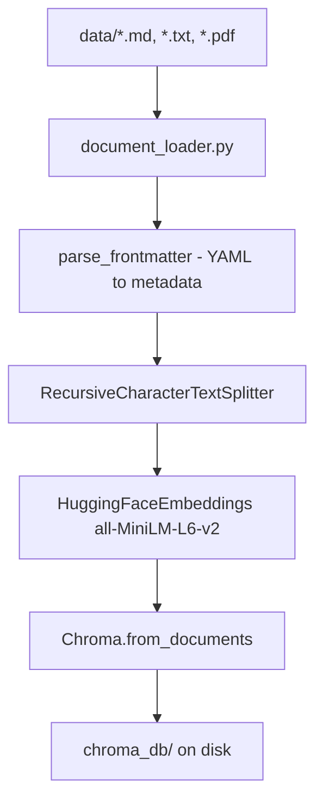
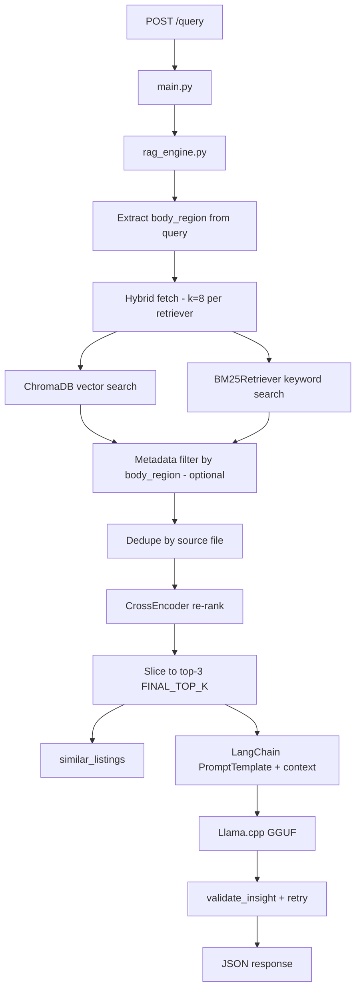
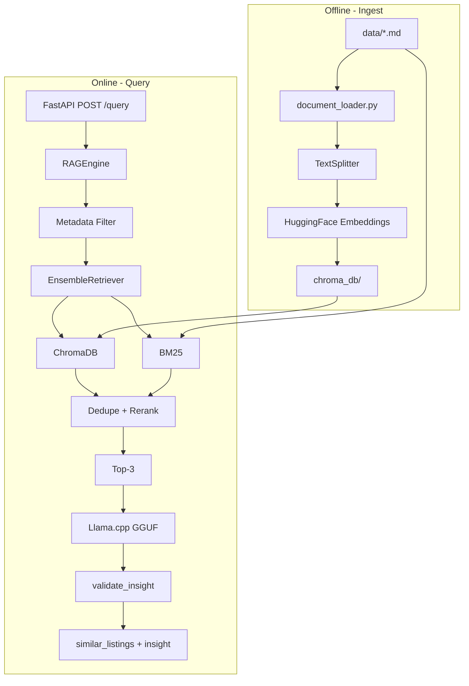

# AthleteCare RAG Service (Service 1)

Local Retrieval-Augmented Generation service for sports medicine clinical insights. Searches club medical protocols and past injury cases using **hybrid search** (ChromaDB vector + BM25 keyword), **metadata filtering**, and **cross-encoder re-ranking**, then generates insights with a local Llama.cpp LLM.

100% local AI — no OpenAI, no cloud vector DB, no Ollama server required.

---

## Tech Stack

| Layer | Technology | Role |
|-------|-----------|------|
| API | FastAPI + Uvicorn | HTTP endpoints (`/health`, `/query`) |
| Orchestration | LangChain | Chains, retrievers, prompts |
| Vector Store | ChromaDB (embedded, local disk) | Semantic similarity search |
| Embeddings | HuggingFace `sentence-transformers/all-MiniLM-L6-v2` | Text → vectors |
| Keyword Search | BM25 (`rank_bm25`) | Lexical / keyword retrieval |
| Hybrid Fusion | LangChain `EnsembleRetriever` | Combines Chroma + BM25 (50/50) |
| Re-ranking | `cross-encoder/ms-marco-MiniLM-L-6-v2` | Re-scores candidates for precision |
| LLM | Llama.cpp via `llama-cpp-python` | Local `.gguf` inference |
| Document Parsing | PyYAML | YAML frontmatter from `.md` files |
| Evaluation | RAGAS + pytest | Faithfulness & answer relevancy |
| Config | python-dotenv | `.env` settings |

---

## Project Structure

```
RAG-Service/
├── app/
│   ├── config.py           # Central settings (paths, retrieval, LLM)
│   ├── document_loader.py  # YAML frontmatter parsing + shared doc loading
│   ├── ingest.py           # Offline ChromaDB population
│   ├── rag_engine.py       # Retrieval pipeline + Llama.cpp generation
│   └── main.py             # FastAPI server
├── data/                   # Medical protocols & case files (.md with YAML frontmatter)
├── models/                 # Local .gguf LLM (not in git)
├── chroma_db/              # Persistent vector store (generated at ingest, gitignored)
├── tests/
│   ├── test_document_loader.py    # Frontmatter parsing tests
│   ├── test_retrieval_pipeline.py # Dedupe, merge, listing format tests
│   ├── test_insight_validation.py # LLM output validation tests
│   └── test_ragas_eval.py         # RAGAS evaluation (requires .gguf)
├── requirements.txt
├── Dockerfile
├── .env.example
└── README.md
```

---

## System Data Flow

### Phase A — Offline Ingest (run once, or after updating `data/`)



| Step | Tool | What happens |
|------|------|--------------|
| 1 | `document_loader.py` | Loads `.md` files; parses YAML frontmatter (`title`, `type`, `body_region`, `date`) into metadata; strips frontmatter from body |
| 2 | `RecursiveCharacterTextSplitter` | Splits documents into ~800-char chunks with 120-char overlap |
| 3 | `HuggingFaceEmbeddings` | Converts each chunk to a normalised vector |
| 4 | `Chroma.from_documents` | Persists vectors + metadata to `chroma_db/` |

**Command:**
```bash
python -m app.ingest
```

> Re-run ingest whenever you add or change files in `data/`.

---

### Phase B — Online Query (every `POST /query`)



| Step | Tool | What happens |
|------|------|--------------|
| 1 | FastAPI (`main.py`) | Receives `{"description": "..."}`, validates input |
| 2 | Region detection | Matches query keywords against known `body_region` values from metadata |
| 3 | ChromaDB | Vector similarity search (`k=8`); filtered by `body_region` when detected |
| 4 | BM25 | Keyword search (`k=8`); post-filtered by `body_region` when detected |
| 5 | Top-up guard | If filtered results < 3, supplements with unfiltered hybrid results |
| 6 | Dedupe | Keeps one chunk per source file (distinct cases/protocols) |
| 7 | CrossEncoder | Re-scores `(query, chunk)` pairs; reorders by relevance |
| 8 | Top-3 cap | Returns exactly `FINAL_TOP_K=3` documents for listings + LLM context |
| 9 | PromptTemplate | Injects top-3 context + query; instructs LLM to cite documents |
| 10 | LlamaCpp | Generates clinical insight JSON locally |
| 11 | `validate_insight` | Rejects placeholders, too-short text; retries once on failure |
| 12 | Response | `{"similar_listings": [...], "insight": "..."}` |

---

## Key Features

### Hybrid Search (ChromaDB + BM25)
Combines semantic vector search with keyword matching via `EnsembleRetriever` (50% / 50% weights). Catches both meaning-based and exact-term matches (e.g. "ACL", "gastrocnemius").

### YAML Frontmatter Metadata
Markdown files in `data/` use YAML frontmatter for structured metadata:

```yaml
---
title: "Calf Tear Case – Player #7 (2024)"
type: case
body_region: calf
date: 2024-03-12
source: Injury Database
---
```

Parsed by `document_loader.py` and stored in ChromaDB metadata. Enables clean listing titles like:
```
[1] Calf Tear Case – Player #7 (2024) [case/calf, 2024-03-12]: ...
```

> Quote titles containing `#` in YAML (e.g. `"Player #7"`) — `#` starts a YAML comment otherwise.

### Metadata Filtering
When the query mentions a known body region (`calf`, `ankle`, `knee`, `hamstring`), ChromaDB and BM25 are filtered to that region. A safety top-up ensures at least 3 results when the filtered set is too small.

### Cross-Encoder Re-ranking
After hybrid retrieval, `cross-encoder/ms-marco-MiniLM-L-6-v2` re-scores each `(query, document)` pair for higher precision before the top-3 cut.

### Insight Validation
Generated insights are validated before returning:
- Minimum length (50 chars)
- No placeholder text (`<your ... here>`)
- No prompt-echo artifacts
- Automatic retry with a stricter prompt on failure
- Safe fallback message if all attempts fail

---

## Setup

### 1. Create a virtual environment

> **Note:** Python 3.11 is recommended for best wheel compatibility with `llama-cpp-python` and `chromadb`. Python 3.13 may work but can require building from source.
>
> **Windows users:** If `pip install` fails with "filename or extension is too long", enable [Long Path support](https://pip.pypa.io/warnings/enable-long-paths) or use a shorter project path (e.g. `C:\dev\rag`).

```bash
cd RAG-Service
python -m venv .venv

# Windows
.venv\Scripts\activate

# macOS / Linux
source .venv/bin/activate
```

### 2. Install dependencies

```bash
pip install --upgrade pip
pip install llama-cpp-python --extra-index-url https://abetlen.github.io/llama-cpp-python/whl/cpu
pip install -r requirements.txt
```

### 3. Add the local LLM model

Download a quantised GGUF (e.g. Llama 3 8B Instruct Q4_K_M, ~4.6 GB) and place it in `models/`:

```
models/llama-3-8b-instruct.gguf
```

See [models/README.md](models/README.md) for details.

### 4. Configure environment

```bash
copy .env.example .env   # Windows
# cp .env.example .env   # macOS / Linux
```

Key settings in `.env`:

| Variable | Default | Description |
|----------|---------|-------------|
| `LLAMA_MODEL_PATH` | `models/llama-3-8b-instruct.gguf` | Path to GGUF model |
| `LLAMA_CHAT_FORMAT` | `llama-3` | Chat template for Llama 3 Instruct |
| `LLAMA_N_GPU_LAYERS` | `0` | GPU offloading (set `35` for full GPU) |
| `RETRIEVER_FETCH_K` | `8` | Raw candidates per sub-retriever |
| `FINAL_TOP_K` | `3` | Final documents returned |
| `ENABLE_METADATA_FILTERING` | `true` | Filter by `body_region` when detected |
| `ENABLE_RERANKING` | `true` | Cross-encoder re-ranking |
| `INSIGHT_MIN_LENGTH` | `50` | Minimum insight character length |
| `LLM_GENERATION_MAX_RETRIES` | `1` | Retry count on validation failure |

### 5. Ingest documents into ChromaDB

```bash
python -m app.ingest
```

Expected output:
```
[ingest] Loading documents from: .../data
  Loaded 4 document(s) total
[ingest] Total raw documents loaded: 4
[ingest] Splitting documents …
  Split into 11 chunk(s)
[ingest] SUCCESS – 11 chunks persisted to '.../chroma_db'
```

---

## Running the Service

```bash
uvicorn app.main:app --reload --host 0.0.0.0 --port 8000
```

> First query after startup loads the LLM (~4.6 GB) and may take 1–3 minutes on CPU. Subsequent queries are faster.

### API Endpoints

| Method | Path | Description |
|--------|------|-------------|
| GET | `/health` | Readiness check (`chroma_db_exists`, `model_exists`) |
| POST | `/query` | Retrieve similar cases + generate clinical insight |

Interactive docs: `http://localhost:8000/docs`

### Example Request

```bash
curl -X POST http://localhost:8000/query \
  -H "Content-Type: application/json" \
  -d "{\"description\": \"Player reports sharp pain in posterior calf during sprinting, unable to continue training.\"}"
```

PowerShell one-liner:
```powershell
curl.exe -X POST http://localhost:8000/query -H "Content-Type: application/json" -d "{\"description\": \"Player reports sharp pain in posterior calf during sprinting, unable to continue training.\"}"
```

### Example Response

```json
{
  "similar_listings": [
    "[1] Calf Tear Case – Player #7 (2024) [case/calf, 2024-03-12]: Player reported sudden sharp pain in the posterior lower leg during a sprint drill...",
    "[2] Ankle Sprain Case – Player #14 (2023) [case/ankle, 2023-09-08]: Player sustained a lateral ankle sprain during a competitive match...",
    "[3] Hamstring Strain Protocol [protocol/hamstring, 2024-01-15]: Progressive eccentric loading and return-to-play criteria..."
  ],
  "insight": "Based on Document 1 (Calf Tear Case P07), sudden posterior calf pain during sprinting is consistent with gastrocnemius tear. Conservative management with delayed stretching from week 3 is recommended; documented return-to-play was 8 weeks."
}
```

---

## Running Tests

```bash
# Frontmatter parsing (fast, no model)
pytest tests/test_document_loader.py -v

# Retrieval pipeline helpers (fast, no model)
pytest tests/test_retrieval_pipeline.py -v

# Insight validation rules (fast, no model)
pytest tests/test_insight_validation.py -v

# RAGAS evaluation (requires local .gguf model, slow)
pytest tests/test_ragas_eval.py::test_ragas_faithfulness_and_answer_relevancy -v -s
```

The RAGAS test is automatically **skipped** if the GGUF model is not present.

---

## Docker

```bash
docker build -t athletecare-rag .
docker run -p 8000:8000 \
  -v $(pwd)/models:/app/models \
  -v $(pwd)/chroma_db:/app/chroma_db \
  athletecare-rag
```

---

## Adding New Documents

1. Add `.md`, `.txt`, or `.pdf` files to `data/`.
2. For `.md` files, include YAML frontmatter with at least `title`, `type`, and `body_region`:

   ```yaml
   ---
   title: "Groin Strain Case – Player #22 (2024)"
   type: case
   body_region: groin
   date: 2024-06-01
   source: Injury Database
   ---
   ```

3. Re-run ingest: `python -m app.ingest`
4. Restart the server (or rely on `--reload`).

> The project spec recommends at least **20 synthetic documents** for meaningful retrieval coverage.

---

## Architecture Overview



---

## Troubleshooting

| Issue | Solution |
|-------|----------|
| `Vector store not found` on `/query` | Run `python -m app.ingest` |
| `model_exists: false` on `/health` | Place `.gguf` file in `models/` |
| SSL error during ingest | Disable firewall temporarily, or set `HF_HUB_OFFLINE=1` if embeddings are cached |
| `pip install llama-cpp-python` fails on Windows | Use prebuilt wheel: `pip install llama-cpp-python --extra-index-url https://abetlen.github.io/llama-cpp-python/whl/cpu` |
| Slow first query | Expected on CPU; subsequent queries are faster. Use GPU via `LLAMA_N_GPU_LAYERS=35` |
| Insight mentions wrong injury type | Known limitation with small dataset (4 docs) and 8B CPU model; add more documents and tune prompt |
