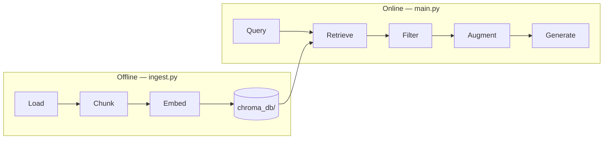
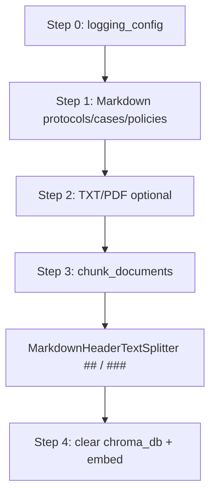
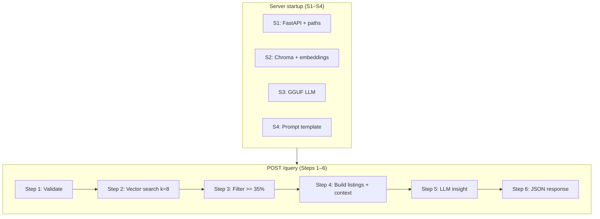

# The Club's Memory — Clinical RAG Service (Service 1)

## Overview

**The Club's Memory** is a local clinical knowledge service for a professional football club medical department. It acts as an intelligent memory layer over the club's official rehabilitation protocols and historical injury cases — allowing staff to ask natural-language questions (e.g. *"What is our hamstring protocol and similar past cases?"*) and receive grounded answers backed by internal documents.

The service is built as **Retrieval-Augmented Generation (RAG)**: it does not rely on the LLM's general training alone. Instead, it **retrieves** relevant chunks from a vector database indexed from club data, **augments** a prompt with that context, and **generates** a short clinical insight via a local model. Retrieved sources are returned with IDs, relevance scores, and provenance so the medical team can verify citations.

**Role in the AthleteCare system (Service 1):**

| Responsibility | Description |
|----------------|-------------|
| **Knowledge store** | Index protocols (`PROT-*`), cases (`CASE-*`), and policies (`POL-*`) from Markdown under `data/` |
| **Semantic search** | Find the most relevant document chunks for an injury description |
| **Clinical insight** | Produce a concise, actionable summary grounded in retrieved context |
| **Local & private** | All embeddings and LLM inference run on-premises — no OpenAI or cloud vector DB |

**Typical workflow:** run `python -m app.ingest` once after data changes → start the API → `POST /query` with a free-text injury description.

---

## RAG Pipeline

The system implements a **classic RAG architecture** in two phases: **offline indexing** (`ingest.py`) and **online query** (`main.py`). Together they cover load → chunk → embed → store → retrieve → filter → augment → generate.

| RAG stage | Implemented | Brief description | Code location |
|-----------|:-------------:|-------------------|---------------|
| **Load** | ✅ | Read Markdown files (YAML frontmatter) from `protocols/`, `cases/`, `policies/`; optional TXT/PDF | `ingest.py` — `load_markdown_documents()`, `load_all_documents()` (Steps 1–2) |
| **Chunk** | ✅ | Split `.md` by `##`/`###`; char split for long TXT/PDF | `ingest.py` — `chunk_documents()` (Step 3) |
| **Embed** | ✅ | Convert each chunk to a vector using `all-MiniLM-L6-v2` | `ingest.py` — `build_vector_store()` (Step 4); same model in `main.py` at startup |
| **Store** | ✅ | Persist vectors + metadata to local ChromaDB | `ingest.py` — `Chroma.from_documents()` → `chroma_db/` |
| **Retrieve** | ✅ | Semantic similarity search for the user query (`k=8` candidates) | `main.py` — `similarity_search_with_relevance_scores()` (query Step 2) |
| **Filter** | ✅ | Drop chunks below minimum relevance (35%); keep top 3 | `main.py` — `MIN_RELEVANCE_SCORE`, `MAX_RESULTS` (query Step 3) |
| **Augment** | ✅ | Inject retrieved chunks into the LLM prompt as `{context}` | `main.py` — `context_blocks` → `prompt.format()` (query Steps 4–5) |
| **Generate** | ✅ | Local GGUF model produces `insight` from context + query | `main.py` — `llm.invoke()` (query Step 5) |

**Not yet implemented (quality enhancements, not core RAG structure):** metadata filters (`body_region`, `date`), deduplication by document ID, hybrid BM25 + vector search, and cross-encoder re-ranking. See [Roadmap](#roadmap-not-yet-implemented) below.



For step-by-step execution order (Step 0, ingest 1–4, startup S1–S4, query 1–6), see [Chronological step reference](#chronological-step-reference) under System Flow.

---

## Tech Stack

| Layer | Technology | Role |
|-------|------------|------|
| API | FastAPI + Uvicorn | HTTP endpoints (`GET /`, `POST /query`) |
| Orchestration | LangChain | Prompt templates, Chroma integration |
| Vector store | ChromaDB (local disk) | Semantic similarity search |
| Embeddings | `sentence-transformers/all-MiniLM-L6-v2` | Text → vectors |
| LLM | Llama.cpp (`llama-cpp-python`) | Local `.gguf` inference |
| Ingest | PyYAML + LangChain splitters | Frontmatter parsing, hybrid chunking |
| Logging | Python `logging` | Ingest + query pipeline visibility |

**Default model:** `models/qwen2.5-1.5b-instruct-q4_k_m.gguf`

---

## Project Structure

```
RAG-Service/
├── app/
│   ├── ingest.py          # Offline: load data → chunk → embed → chroma_db/
│   ├── logging_config.py  # Shared logging; silences noisy third-party libraries
│   └── main.py            # Online: FastAPI + retrieval + LLM insight
├── data/
│   ├── catalog.json       # Document index (admin reference — NOT ingested)
│   ├── protocols/         # RTP protocols (type: protocol)
│   ├── cases/             # Historical injury cases (type: case)
│   └── policies/          # Load management & recovery (type: policy)
├── models/                # Local .gguf file (gitignored)
├── chroma_db/             # Vector store (generated by ingest, gitignored)
├── tests/                 # Unit / integration tests
├── requirements.txt       # Runtime (API + ingest) — use this in Docker
├── requirements-dev.txt   # Optional: pytest / ragas eval
├── Dockerfile
└── README.md
```

---

## Data Model

All sources share a unified metadata schema stored in ChromaDB:

| Field | Description | Example |
|-------|-------------|---------|
| `id` | Stable document ID for citations | `PROT-HAM-01`, `CASE-2025-11`, `POL-GPS-01` |
| `type` | Document category | `protocol`, `case`, `policy` |
| `category` | Sub-category (optional) | `rtp`, `load_management`, `recovery` |
| `body_region` | Anatomical region or `general` | `hamstring`, `calf`, `knee`, `general` |
| `date` | ISO date string | `2025-11-15` |
| `source` | Provenance label | `Club Medical Department`, `Performance Department` |
| `linked_protocol_id` | Case → protocol link (optional) | `PROT-HAM-01` |
| `days_to_return` | Case RTP duration in days (optional) | `22` |
| `section` / `subsection` | Markdown heading (chunks from `.md`) | `Phase 2 – Sub-acute` |

### Catalog (`catalog.json`)

Human-readable index of all document IDs and file paths. **Not ingested** into Chroma — use it for admin reference or future UI tooling.

### Markdown (`data/**/*.md`)

All clinical content lives in Markdown with YAML frontmatter. Organized by folder:

| Folder | `type` | Section template (`##`) |
|--------|--------|-------------------------|
| `protocols/` | `protocol` | Classification, Phases, Return-to-Play Criteria, Club Benchmark |
| `cases/` | `case` | Incident Summary, Diagnosis, Treatment Timeline, Outcome, Clinical Insight |
| `policies/` | `policy` | One `##` per rule cluster (GPS thresholds, recovery rules, etc.) |

Example case frontmatter:

```yaml
---
id: CASE-2025-11
title: "Hamstring Strain Case – Winger (2025)"
type: case
category: case
body_region: hamstring
date: 2025-11-15
source: Injury Database
linked_protocol_id: PROT-HAM-01
days_to_return: 22
---
```

> Quote YAML titles containing `#` (e.g. `"Player #7"`) — bare `#` starts a YAML comment.

---

## System Flow

### Chronological step reference

All pipelines share **Step 0** (logging). Ingest runs **Steps 1–4** offline; the API runs **Steps S1–S4** at startup, then **Steps 1–6** on each `POST /query`.

| Step | When | File | What happens |
|------|------|------|--------------|
| **0** | Before everything | `logging_config.py` | Configure logging; silence third-party libraries |
| **1** | Ingest | `ingest.py` → `load_markdown_documents()` | Load `*.md` from protocols/, cases/, policies/ |
| **2** | Ingest | `ingest.py` → `load_all_documents()` | Load optional TXT/PDF files |
| **3** | Ingest | `ingest.py` → `chunk_documents()` | Header-based chunking (`##` / `###`) |
| **4** | Ingest | `ingest.py` → `build_vector_store()` | Clear `chroma_db/`, embed, persist |
| **S1** | Server startup | `main.py` | FastAPI app + paths + retrieval constants |
| **S2** | Server startup | `main.py` | Load embeddings + connect to `chroma_db/` |
| **S3** | Server startup | `main.py` | Load local GGUF model (LlamaCpp) |
| **S4** | Server startup | `main.py` | Define prompt template for insight generation |
| **1** | Each query | `main.py` → `query_rag()` | Validate input; check Chroma + LLM available |
| **2** | Each query | `main.py` → `query_rag()` | Vector search with relevance scores (`k=8`) |
| **3** | Each query | `main.py` → `query_rag()` | Filter `>= 35%` relevance; keep top 3 |
| **4** | Each query | `main.py` → `query_rag()` | Build `similar_listings` + LLM context blocks |
| **5** | Each query | `main.py` → `query_rag()` | Invoke local LLM → generate `insight` |
| **6** | Each query | `main.py` → `query_rag()` | Return JSON `{ similar_listings, insight }` |

---

### Phase A — Offline ingest (Steps 0–4)



| Step | What happens |
|------|----------------|
| 0 | Configure logging (`logging_config.py`) |
| 1 | Load `.md` files; parse YAML frontmatter; body only in `page_content` |
| 2 | Load optional `.txt` / `.pdf` files (if present) |
| 3 | **Header chunking:** `.md` → split by `##` / `###` |
| 4 | Clear existing `chroma_db/`, embed all chunks, persist |

**Command:**

```bash
cd RAG-Service
python -m app.ingest
```

Re-run whenever you change files under `data/`.

---

### Phase B — Online query (Steps S1–S4 at startup, Steps 1–6 per request)



| Step | When | What happens |
|------|------|----------------|
| S1–S4 | Server startup | Load FastAPI, Chroma, LLM, prompt (once) |
| 1 | Each query | Receive and validate `{"description": "..."}`; check Chroma + model |
| 2 | Each query | Vector search with normalized relevance scores (0–1), `k=8` |
| 3 | Each query | Drop chunks below `MIN_RELEVANCE_SCORE` (35%); cap at 3 results |
| 4 | Each query | Build structured `similar_listings` + context blocks for LLM |
| 5 | Each query | Generate `insight` via local LLM |
| 6 | Each query | Return `{ similar_listings, insight }` |

---

## API

### Endpoints

| Method | Path | Description |
|--------|------|-------------|
| GET | `/` | Service status (`ready` / `degraded`), paths check |
| POST | `/query` | Retrieve similar documents + clinical insight |

Interactive docs: `http://localhost:8000/docs`

### Request

```json
{
  "description": "A player sustained a sharp pain in his back thigh during sprint training. Bring me the official club protocol for hamstring strain and any past cases from last year."
}
```

### Response

```json
{
  "similar_listings": [
    {
      "id": "PROT-HAM-01",
      "type": "protocol",
      "relevance_score": "71.2%",
      "source": "Club Medical Department",
      "content": "Title: Official Club Protocol: Grade 1-2 Hamstring Strain Rehabilitation\n\nPhase 1 Acute..."
    },
    {
      "id": "CASE-2025-11",
      "type": "case",
      "relevance_score": "67.4%",
      "source": "Injury Database",
      "content": "Title: Historical Case: Winger - Grade 2 Biceps Femoris Strain\n\nOccurred November 2025..."
    }
  ],
  "insight": "[Based on ID: PROT-HAM-01] ..."
}
```

| Field | Meaning |
|-------|---------|
| `relevance_score` | Vector similarity (0–100%), not clinical confidence |
| `source` | Department or database label from metadata |
| `content` | Retrieved chunk text sent to the LLM as context |

---

## Setup

### 1. Virtual environment

```bash
cd RAG-Service
python -m venv .venv

# Windows
.venv\Scripts\activate

# macOS / Linux
source .venv/bin/activate
```

Python 3.11+ recommended. On Windows, enable [long path support](https://pip.pypa.io/warnings/enable-long-paths) if installs fail.

### 2. Install dependencies

```bash
pip install --upgrade pip
pip install llama-cpp-python --extra-index-url https://abetlen.github.io/llama-cpp-python/whl/cpu
pip install -r requirements.txt
```

### 3. Add the GGUF model

Place the model in `models/`:

```
models/qwen2.5-1.5b-instruct-q4_k_m.gguf
```

Update `MODEL_PATH` in `app/main.py` if you use a different filename.

### 4. Ingest documents

```bash
# Ingest auto-clears chroma_db/ before each run
python -m app.ingest
```

Expected log (INFO level):

```
=== RAG Ingestion Started ===
Cleared existing vector store at '.../chroma_db'
Step 1/4 — Loading markdown files (8 found)
Step 2/4 — Loading optional TXT/PDF files
Step 3/4 — Chunking ...
Chunking summary — 42 total chunk(s) from 8 source document(s)
Step 4/4 — Generating embeddings ...
=== Ingestion SUCCESS — N chunks persisted to '.../chroma_db' ===
```

### 5. Run the service

```bash
uvicorn app.main:app --reload --host 0.0.0.0 --port 8000
```

First query loads the LLM into memory; subsequent queries are faster.

---

## Logging & Debug

Set log verbosity with the environment variable **`RAG_LOG_LEVEL`**:

| Level | Ingest | Query (`POST /query`) |
|-------|--------|------------------------|
| `INFO` (default) | Steps, document counts, chunk summary by ID | Candidates, relevance filter, LLM char counts |
| `DEBUG` | Frontmatter keys, chunk previews, section labels | Full context preview, chunk text previews |

Third-party libraries (`httpx`, `sentence_transformers`, `huggingface_hub`, etc.) are silenced via `app/logging_config.py` — only `rag.ingest` / `rag.query` messages appear at INFO.

**Examples:**

```bash
# Verbose ingest
set RAG_LOG_LEVEL=DEBUG
python -m app.ingest

# Verbose API (Windows cmd)
set RAG_LOG_LEVEL=DEBUG
uvicorn app.main:app --reload --port 8000
```

```powershell
# PowerShell
$env:RAG_LOG_LEVEL = "DEBUG"
python -m app.ingest
```

Log format:

```
HH:MM:SS | INFO    | rag.ingest | Step 1/4 — Loading markdown files (8 found)
HH:MM:SS | INFO    | rag.query  | Retrieval returned 8 candidate(s) (k=8)
```

---

## Configuration (code constants)

| Constant | File | Default | Description |
|----------|------|---------|-------------|
| `RETRIEVAL_K` | `main.py` | `8` | Candidates fetched from Chroma |
| `MAX_RESULTS` | `main.py` | `3` | Max items in `similar_listings` |
| `MIN_RELEVANCE_SCORE` | `main.py` | `0.35` | Minimum normalized relevance |
| `MD_HEADERS_TO_SPLIT` | `ingest.py` | `##`, `###` | Markdown section boundaries |
| `SINGLE_DOC_MAX_CHARS` | `ingest.py` | `800` | Short non-MD docs kept as one chunk if shorter |

---

## Adding New Documents

1. Create a new `.md` file in the correct folder under `data/`:
   - `protocols/` — RTP protocols (`type: protocol`)
   - `cases/` — historical cases (`type: case`)
   - `policies/` — load/recovery rules (`type: policy`)
2. Include required frontmatter: `id`, `type`, `body_region`, `date`, `source`.
3. Use `##` section headers so ingest splits into searchable chunks.
4. Add an entry to `catalog.json` for admin reference.
5. Run `python -m app.ingest` (auto-clears `chroma_db/`) and restart the API.

---

## Troubleshooting

| Issue | Solution |
|-------|----------|
| `Vector Database not found` | Run `python -m app.ingest` |
| `model_exists: false` | Place `.gguf` in `models/` |
| SSL / HuggingFace error on ingest | Cache embeddings locally or fix network; retry ingest |
| Wrong injury type in `insight` | Small model + mixed context; improve data, raise `MIN_RELEVANCE_SCORE`, or use a larger GGUF |
| `id: N/A` in responses | Re-ingest after metadata changes; ensure frontmatter includes `id` |
| Tests import `document_loader` | Legacy tests — loader logic now lives in `ingest.py` |

---

## Tests

```bash
pip install -r requirements-dev.txt
pytest tests/ -v
```

Some tests target modules from an earlier architecture and may need updates. Ingest and query logging do not require a GGUF model.

---

## Docker

```bash
docker build -t athletecare-rag .
docker run -p 8000:8000 \
  -v $(pwd)/models:/app/models \
  -v $(pwd)/chroma_db:/app/chroma_db \
  -e RAG_LOG_LEVEL=INFO \
  athletecare-rag
```

---

## Roadmap (not yet implemented)

- Chroma metadata `filter` by `body_region` on query
- Temporal filter for "past cases from last year" using `date`
- Prompt/context cleanup for smaller models
- Hybrid BM25 + cross-encoder re-ranking (see project spec)
